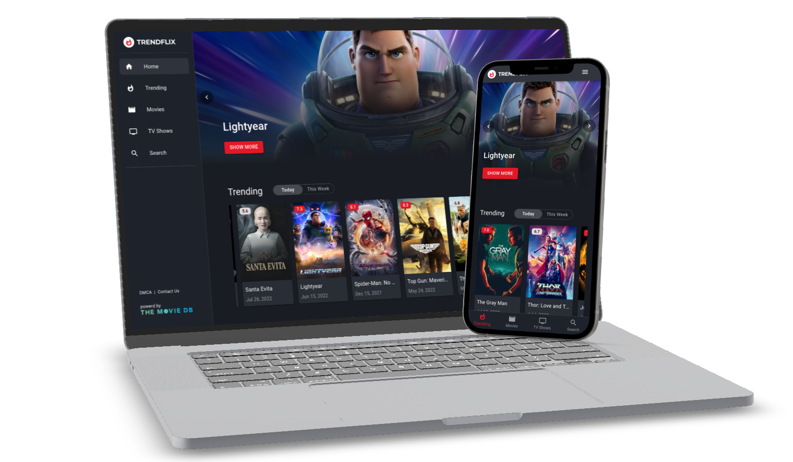

# 

Movie Search App with ReactJS and TMDb API

<h3>About</h3>

This is a multi-page React app, that takes advantage of TMDB API and allows users to browse movies, watch trailers, discover upcoming and trending titles.

<code>react</code>
<code>tmdb-api</code>
<code>material-ui</code>
<code>react-router</code>
<code>responsive-design</code>
